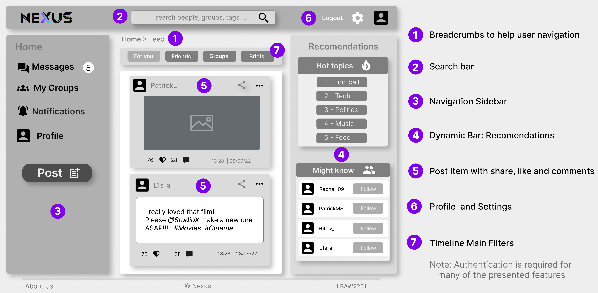
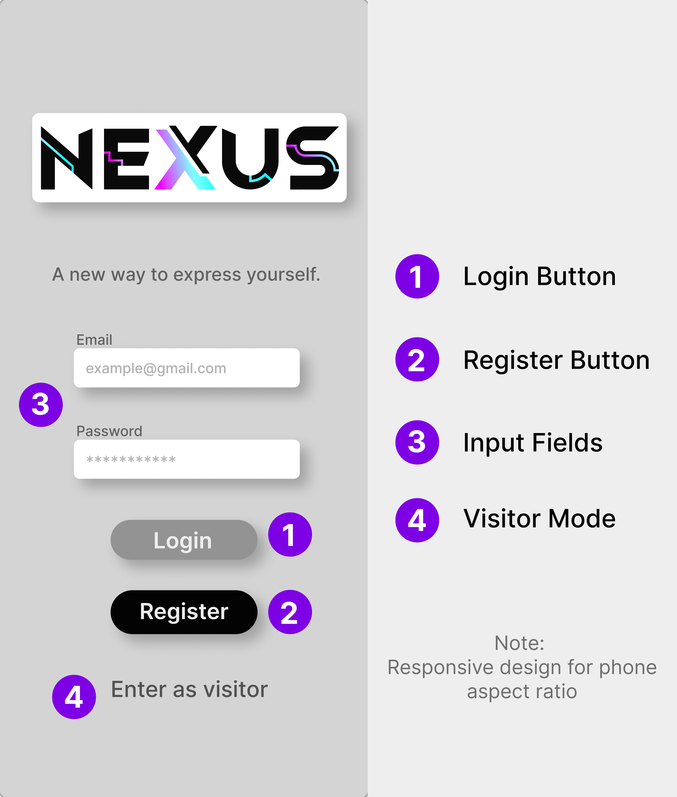

# LBAW 2261


**Nexus** is a revolutionary new social network that connects people from all walks of life. With a sleek and intuitive interface, users can easily create profiles, share their interests and passions by making posts, comments and likes and by creating or joining pre-existing thematic groups to connect with friends and family. This communication is further facilitated by Nexus built-in chat with possibility to make video calls so you can be closer to the ones you love.

See our product demo on YouTube: 

[](https://www.youtube.com/watch?v=-eqYxbMFlLA)

## Wireframes

The wireframes below illustrate the design and layout of the Nexus application during development. They provide a visual representation of the user interface and user experience, showcasing the main features and functionalities of the platform.

### Home Page



### Login Page



### Individual Post Page


### Profile Page


### Direct Messages Page


## How to Run

To run the Nexus application, you need to have Docker installed on your machine. Once Docker is set up, you can pull the image from the GitLab Container Registry and run it using the command provided below.

### Docker Command

The the full Docker command needed to start the image available at the group's GitLab Container Registry using the production database can be found below:

```bash
sudo docker run -it -p 8000:80 --name=lbaw2261 -e DB_DATABASE="lbaw2261" -e DB_SCHEMA="lbaw2261" -e DB_USERNAME="lbaw2261" -e DB_PASSWORD="cGtzVMep" git.fe.up.pt:5050/lbaw/lbaw2223/lbaw2261
```

#### Access Credentials

To access the Nexus application, you can use the following credentials depending on the user type you want to simulate:

| User Type | Email            | Password |
| -------- |----------------  | -------- |
| Admin    | admin@gmail.com  | password |
| User     | user@gmail.com   | password |
| Banned User  | banned@example.net   | password |

## Team

| Name           | Email                        |
|----------------|------------------------------|
| David Ferreira | up202006302@g.uporto.pt      |
| João Alves     | up202007614@g.uporto.pt      |
| Marco André    | up202004891@g.uporto.pt      |
| Ricardo Matos  | up202007962@g.uporto.pt      |

